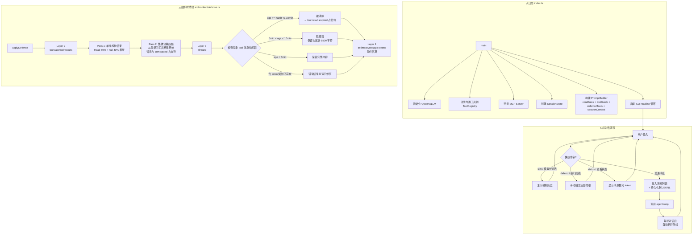
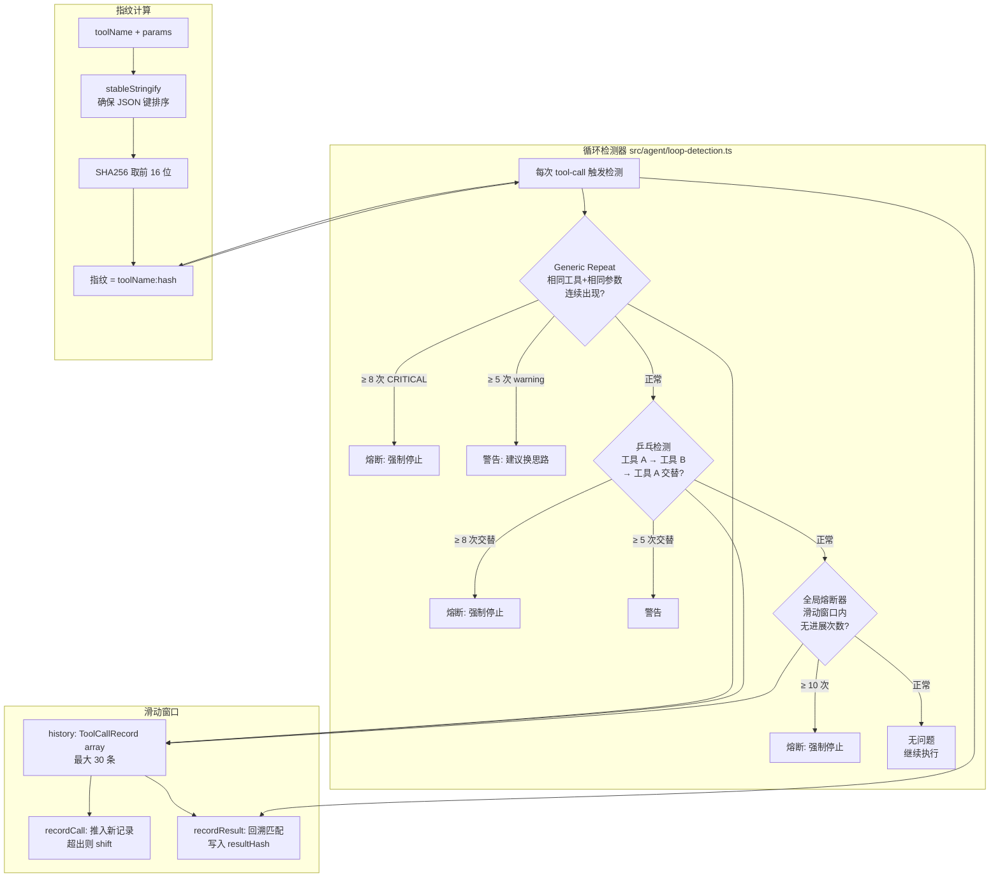
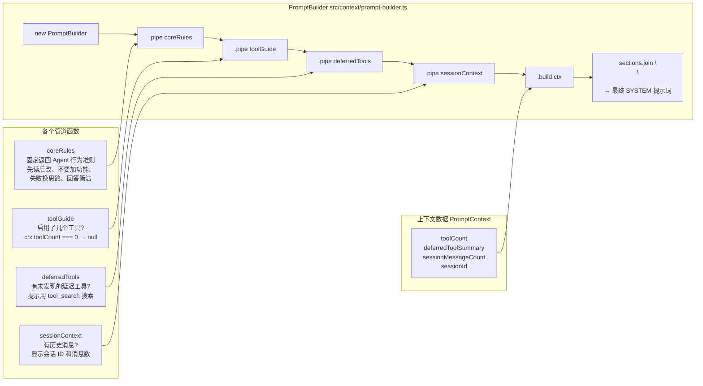
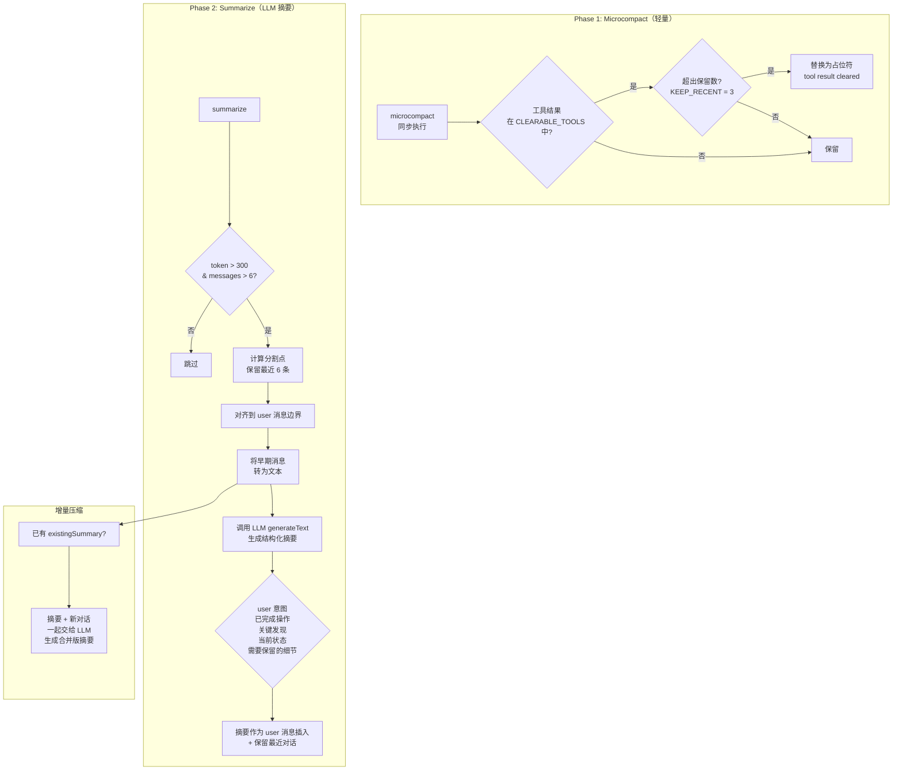
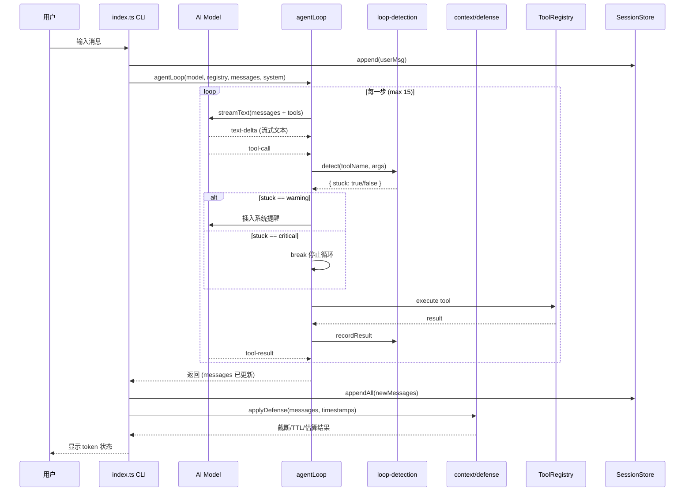

# Super Agent v0.9 — Architecture Overview

> 上下文防御系统 + Agent 循环引擎

## 一、项目概览

一个可交互的 AI Agent 系统，核心特色是 **三层上下文防线**：实时估算 token 用量、动态截断工具结果、按 TTL 自动清理过期的上下文。同时具备循环检测、自动重试、MCP 协议扩展、Prompt Pipe 等能力。

```
F:\i\super_agent\6_context-defense\
├── src/
│   ├── index.ts                 # 入口：CLI 交互、防线演示、组装各模块
│   ├── mock-model.ts            # Mock 模型（开发/离线时模拟 LLM）
│   │
│   ├── context/
│   │   ├── defense.ts           # 【核心】三层即时防线（估算/截断/TTL）
│   │   ├── compressor.ts        # 上下文压缩器（轻量 + LLM 摘要两阶段）
│   │   └── prompt-builder.ts    # Prompt Pipe：管道式构建系统提示词
│   │
│   ├── agent/
│   │   ├── loop.ts              # Agent 主循环（流式调用 LLM + 工具执行）
│   │   ├── loop-detection.ts    # 循环检测（三种模式：重复/乒乓/熔断）
│   │   └── retry.ts             # 自动重试（指数退避 + 抖动）
│   │
│   ├── tools/
│   │   ├── index.ts             # 工具批量导出
│   │   ├── registry.ts          # 工具注册中心 + MCP 管理 + 并发控制
│   │   ├── mcp-client.ts        # MCP 协议客户端（Node 子进程通信）
│   │   ├── file-tools.ts        # 文件读写/编辑/列表
│   │   ├── shell-tools.ts       # Shell 命令执行
│   │   ├── search-tools.ts      # 文件搜索（glob + grep）
│   │   ├── utility-tools.ts     # 天气查询 + 计算器
│   │   └── web-search.ts        # 联网搜索（Tavily / Serper）+ 网页抓取
│   │
│   └── session/
│       └── store.ts             # 会话持久化（JSONL 文件）
│
├── .sessions/                   # 会话记录目录（JSONL）
├── .env                         # API Key 配置
├── package.json
└── tsconfig.json
```

---

## 二、核心架构流程图



---

## 三、Agent 循环流程

```mermaid
flowchart LR
    subgraph Loop["Agent 循环 src/agent/loop.ts"]
        L1[agentLoop 开始] --> L2[重置检测器历史]
        L2 --> L3[Step N<br/>MAX_STEPS = 15]
        L3 --> L4{已有步骤的<br/>token 超预算?}
        L4 -->|> 50000| L5[Token 预算耗尽<br/>停止]
        L4 -->|否| L6[调用 streamText<br/>流式 LLM + 工具]
        L6 --> L7{流式处理事件}
        
        L7 -->|text-delta| L8[输出文本到终端]
        L7 -->|tool-call| L9[循环检测 detect]
        L9 --> L10{检测结果}
        L10 -->|stuck:warning| L11[插入系统提醒<br/>换一个思路]
        L10 -->|stuck:critical| L12[熔断<br/>停止循环]
        L10 -->|正常| L13[记录调用<br/>recordCall]
        L7 -->|tool-result| L14[记录结果<br/>recordResult]
        
        L8 --> L15{finishReason}
        L13 --> L15
        L14 --> L15
        L15 -->|tool-calls| L16[有工具调用<br/>→ 继续下一步]
        L16 --> L3
        L15 -->|stop| L17[无工具调用<br/>→ 结束循环]
    end

    subgraph Retry["重试机制 src/agent/retry.ts"]
        R1[API 调用异常] --> R2{可重试?}
        R2 -->|429/529/408/5xx<br/>ECONNRESET/ETIMEDOUT<br/>fetch failed| R3[指数退避<br/>base 500ms × 2^(n-1)<br/>+ 25% 随机抖动<br/>max 30s]
        R2 -->|4xx 非限流| R4[不重试<br/>直接抛错]
        R3 --> R5{超过 MAX_RETRIES=3?}
        R5 -->|否| R6[重试完整 Step]
        R5 -->|是| R7[抛出异常退出]
    end

    L4 -->|API 异常| R1
    R6 --> L6
```

---

## 四、循环检测系统



---

## 五、工具系统架构

```mermaid
flowchart TB
    subgraph Registry["工具注册中心 src/tools/registry.ts"]
        R[ToolRegistry]
        R1["Map<name, ToolDefinition>"]
        R --> R1
        R --> R2[MCP Client 列表]
        R --> R3[读写锁并发控制]
        R --> R4[Profile 过滤]
        R --> R5[延迟加载机制]
        
        R3 -->|读安全 isConcurrencySafe=true| RC[共享锁<br/>多个同时执行]
        R3 -->|写 isConcurrencySafe=false| RE[排他锁<br/>一次只能一个]
        
        R4 -->|profile=['full']| P1[默认加载]
        R4 -->|shouldDefer=true| P2[不载入 active<br/>需 tool_search 发现]
        
        R5 --> P2
    end

    subgraph Tools["工具定义"]
        T1[get_weather<br/>天气查询]:::builtin
        T2[calculator<br/>表达式计算]:::builtin
        T3[read_file<br/>读文件]:::builtin
        T4[write_file<br/>写文件]:::builtin
        T5[edit_file<br/>编辑文件]:::builtin
        T6[list_directory<br/>列出目录]:::builtin
        T7[glob<br/>搜索文件]:::builtin
        T8[grep<br/>搜索内容]:::builtin
        T9[bash<br/>执行命令]:::builtin
        T10[web_search<br/>联网搜索]:::builtin
        T11[web_fetch<br/>网页抓取]:::builtin
        T12[tool_search<br/>搜索延迟工具]:::builtin
    end

    subgraph MCP["MCP 外部工具"]
        M1[GitHub Issues<br/>mcp__github__list_issues]:::mcp
        M2[GitHub 仓库搜索<br/>mcp__github__search_repositories]:::mcp
        M3[获取文件内容<br/>mcp__github__get_file_contents]:::mcp
    end

    Registry -->|toAISDKFormat| SDK[AI SDK 格式<br/>传给 LLM]
    
    T12 -.->|搜索| R4
    R -.->|应延迟?| M1
    
    classDef builtin fill:#e1f5fe,stroke:#0288d1
    classDef mcp fill:#f3e5f5,stroke:#7b1fa2
```

---

## 六、Prompt Pipe 系统



---

## 七、会话持久化

```mermaid
flowchart LR
    subgraph Session["Session Store src/session/store.ts"]
        S[SessionStore] --> S1[append msg]
        S --> S2[appendAll<br/>批量写入]
        S --> S3[load<br/>从 JSONL 恢复]
        S --> S4[getMessageCount]
    end

    subgraph Storage["存储"]
        F1[.sessions/default.jsonl]
        F2["每条一行 JSON<br/>{type,timestamp,message}"]
    end

    subgraph Flow["数据流"]
        F[用户输入<br/>+ Agent 回复<br/>+ 工具调用/结果] -->|每轮追加| S1
        S1 -->|appendFileSync| F1
        S1 --> F2
        
        A[启动时<br/>--continue 参数] -->|load| S3
        S3 -->|恢复到 messages[]| M[继续对话]
    end
```

---

## 八、上下文压缩器（两阶段）



---

## 九、数据流全景



---

## 十、关键参数一览

| 模块 | 参数 | 值 | 说明 |
|------|------|-----|------|
| **Agent Loop** | MAX_STEPS | 15 | 单轮对话最多 15 步工具调用 |
| | MAX_RETRIES | 3 | API 调用最多重试 3 次 |
| | TOKEN_BUDGET | 50000 | 单轮对话 token 预算 |
| **Defense** | CONTEXT_WINDOW | 200000 | 假设的上下文窗口大小 |
| | maxSingleResult | 100000 (50% × 2) | 单条工具结果最大字符数 |
| | contextBudgetChars | 150000 (75% × 4) | 工具结果总预算字符数 |
| | Head/Tail 比例 | 60/40 | 截断时保留头部 60%、尾部 40% |
| | softTTL | 5 分钟 | > 5 分钟的消息被软修剪 |
| | hardTTL | 10 分钟 | > 10 分钟的消息被硬清除 |
| | keepHeadTail | 1500 字符 | 软修剪时保留的头尾字符数 |
| **Loop Detection** | HISTORY_SIZE | 30 | 滑动窗口大小 |
| | WARNING_THRESHOLD | 5 | 警告阈值 |
| | CRITICAL_THRESHOLD | 8 | 严重/熔断阈值 |
| | BREAKER_THRESHOLD | 10 | 全局熔断阈值 |
| **Compressor** | CONTEXT_TOKEN_THRESHOLD | 300 | 触发 LLM 摘要的 token 阈值 |
| | KEEP_RECENT_MESSAGES | 6 | 压缩后保留的最近消息数 |
| | KEEP_RECENT_TOOL_RESULTS | 3 | 轻量压缩保留的最近工具结果数 |
| **Retry** | base delay | 500ms | 指数退避基数 |
| | max delay | 30000ms | 最大退避时间 |

---

## 十一、快捷命令

CLI 中支持以下快捷命令，用于测试和调试：

| 命令 | 简写 | 功能 |
|------|------|------|
| `模拟长对话` | `sim` | 注入 20 条模拟历史消息（含大工具结果），用于测试防线效果 |
| `执行防线` | `defend` | 手动执行三层防线，显示截断/TTL/估算前后对比 |
| `查看状态` | `status` | 查看当前消息数和 token 估算 |

---

## 十二、运行方式

```bash
# 正常启动（需要 .env 中配置 AI_KEY）
pnpm start

# 无 API Key 时自动使用 Mock Model（离线测试）
# 设置 .env:
AI_KEY=your-api-key-here
# 可选：搜索 API
TAVILY_API_KEY=xxx   # 或
SERPER_API_KEY=xxx
```
